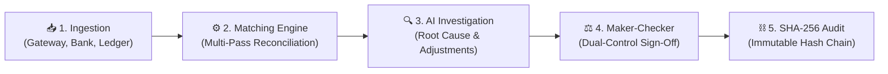

# 🏦 Recon

> **Autonomous Three-Way Financial Reconciliation & AI-Powered Audit Platform**
> Automatically matches transactions across Payment Gateways, Bank Statements, and ERP General Ledgers with deterministic precision, AI exception analysis, and cryptographic audit trails.

[](https://www.python.org/)
[](https://fastapi.tiangolo.com/)
[](https://ai.google.dev/)
[](https://www.sqlite.org/)
[](https://redis.io/)
[](https://www.docker.com/)

---

## ⚡ Quick Start (60 Seconds)

Get the application running locally in 3 steps:

```bash
# 1. Setup virtual environment
python -m venv .venv
.\.venv\Scripts\activate      # On macOS/Linux: source .venv/bin/activate

# 2. Install dependencies
pip install -r backend/requirements.txt

# 3. Start application
python -m uvicorn app.main:app --host 127.0.0.1 --port 8000 --app-dir backend
```

Open your browser at **[http://127.0.0.1:8000](http://127.0.0.1:8000)** and sign in:

| Role | Email | Password | Access Level |
|---|---|---|---|
| **Controller (Admin)** | `admin@acme.co` | `Admin@2026!` | Full administrative access, audit chain inspection, all approvals |
| **Approver (Checker)** | `approver@acme.co` | `Approver@2026!` | Maker-Checker dual control sign-off on journal adjustment vouchers |
| **Analyst (Maker)** | `analyst@acme.co` | `Analyst@2026!` | Ingest CSVs, trigger reconciliation batches, draft proposals |

> **Tip**: You can also click **"Sign in as Admin (Full Access)"** on the login screen for instant one-click demo access.

---

## 💡 What Problem Does This Solve?

Finance teams spend **up to 70% of their time manually reconciling transactions** between three disconnected systems:

```
  1. Payment Gateway           2. Bank Statement           3. General Ledger (ERP)
  (Razorpay, Stripe)           (HDFC, ICICI, Citi)         (NetSuite, SAP, Tally)
  Gross customer charge        Net wire payout             Accounting journal entry
        │                             │                               │
        └─────────────────────────────┼───────────────────────────────┘
                                      ▼
                       ⚠️ THE SETTLEMENT DISCREPANCY
            Gross Payment: ₹10,000  vs  Bank Deposit: ₹9,764
            Breakdown: 2% MDR Fee (₹200) + 18% GST on Fee (₹36)
```

### Why Traditional Systems Fail:
- **Fee Deductions**: Gateways deduct Merchant Discount Rates (MDR) and tax before wiring net funds to the bank.
- **Batch Payouts (N:1)**: Gateways bundle hundreds of individual customer transactions into single lump-sum bank deposits.
- **Timing Differences (T+2)**: Friday transactions settle in the bank on Tuesday, causing false discrepancy flags.
- **AI Math Hallucinations**: Standard LLMs cannot be trusted with financial calculations and ledger entries.

---

## ✨ Key Features

- **🔄 Automated 3-Way Reconciliation**: Matches Gateway captures, Bank payouts, and ERP Ledgers across exact references, fee splits, and batched deposits.
- **🛡️ Zero-Arithmetic-Trust Verifier Gate**: All calculations use integer minor units (paise) with deterministic Python math checks before any AI recommendation is accepted.
- **🤖 Autonomous AI Exception Investigator**: Pinpoints exact root causes (cutoff delays, missing bank credits, fee tier changes) and drafts balanced journal adjustment entries.
- **⚖️ Maker-Checker Dual Governance**: Strict segregation of duties—analysts propose adjustments, but only authorized approvers can release and finalize them.
- **⛓️ Cryptographic SHA-256 Audit Chain**: Every financial event, approval, and batch execution is sealed in a tamper-evident sequential hash chain.
- **💬 Conversational Financial Assistant (`Ctrl+K`)**: Ask natural language questions about match rates, specific invoice references, or cash runway.

---

## 🏛️ How It Works



1. **Ingest**: Upload Gateway, Bank, and Ledger CSV feeds (or load the bundled reference fixtures).
2. **Reconcile**: The engine executes multi-pass matching (exact reference keys, fee logic, and batch settlement solvers).
3. **Investigate**: Unmatched items are classified and analyzed by AI agents to draft proposed adjustments.
4. **Approve**: An Approver reviews and signs off on vouchers in the Maker-Checker queue.
5. **Audit**: Every action is cryptographically chained and verifiable in real time.

---

## 🛠️ Technology Stack

| Layer | Technologies | Purpose |
|---|---|---|
| **Backend Framework** | **FastAPI**, **Uvicorn**, **Python 3.10+ / 3.14** | High-performance asynchronous REST API, OpenAPI docs, and dependency injection |
| **Data Contracts** | **Pydantic v2**, **Pydantic-Settings** | Strict data validation schemas, financial data types, and typed environment settings |
| **Relational Database** | **SQLAlchemy 2.0**, **PostgreSQL 16**, **SQLite** | Dual DB support: embedded zero-config SQLite locally, enterprise PostgreSQL in Docker |
| **Cache & Distributed Locks** | **Redis 7**, **Fakeredis** | Redlock distributed concurrency control, dynamic query caching, and fail-open resilience |
| **Algorithmic Engine** | **Polars**, **NumPy**, **SciPy**, **RapidFuzz** | Vectorized CSV processing, N:1 subset-sum solver, and fuzzy payment reference matching |
| **AI & Multi-Agent** | **Google Gemini 1.5 Pro / Flash**, **LangGraph** | Multi-turn conversational investigation, agent workflow graphs, and RAG knowledge lookup |
| **Model Redundancy** | **Anthropic Claude 3.5**, **Groq (Llama 3)** | Pluggable secondary model providers for high availability and benchmark parity |
| **Security & Auth** | **Argon2id (`argon2-cffi`)**, **PyJWT** | OWASP-recommended password hashing and stateless Role-Based Access Control (RBAC) |
| **Audit & Cryptography** | **Python `hashlib` (SHA-256)** | Cryptographically linked tamper-evident audit ledger blocks for SOX compliance |
| **Frontend Architecture** | **Vanilla HTML5**, **CSS3**, **ES6+ JavaScript** | Modern monochromatic design system, zero build step overhead, dark/light themes |
| **Data Visualizations** | **Chart.js** | Interactive charts for settlement velocity, match rates, and fee tier distributions |
| **DevOps & Containers** | **Docker**, **Docker Compose**, **Nginx (Alpine)** | Multi-container production deployment with health checks and static file serving |
| **Testing Harness** | **Pytest**, **AsyncIO** | 25 test suites containing 198 automated unit, adversarial, and benchmark tests |

---

## 📂 Project Structure

```text
recon/
├── backend/
│   ├── app/
│   │   ├── api/v1/          # REST endpoints (auth, batches, exceptions, audit, qa)
│   │   ├── core/            # Configuration, security, and Redis locks
│   │   ├── db/              # Database schemas and services (SQLite / PostgreSQL)
│   │   ├── models/          # Pydantic data schemas
│   │   └── services/        # Matching engine, AI reasoning agents, audit hash chain
│   └── tests/               # 25 test suites covering 198 automated test cases
├── frontend/
│   ├── index.html           # Modern single-page financial console
│   └── static/
│       ├── css/styles.css   # Monochromatic dark/light design system
│       └── js/app.js        # Reactive client and state management
├── data/
│   ├── gateway.csv          # Reference Payment Gateway dataset (Razorpay/Stripe)
│   ├── bank.csv             # Reference Bank Statement dataset (HDFC/ICICI)
│   ├── general_ledger.csv   # Reference ERP General Ledger dataset (NetSuite)
│   └── ground_truth_links.json # Benchmark ground-truth validation data
├── docs/                    # System architecture specification & interactive diagram
├── docker-compose.yml       # Production stack (App + PostgreSQL + Redis)
└── README.md                # Project documentation
```

---

## 🧪 Testing

The codebase includes a comprehensive automated test suite covering reconciliation accuracy, accounting semantics, security, and agent verification:

```bash
# Run the full test suite
pytest backend/tests/ -v
```

```text
=================== 198 passed in ~3m 50s (100% success rate) ===================
```

---

## 🐳 Docker Deployment

To run the complete production container stack (FastAPI + PostgreSQL + Redis):

```bash
docker-compose up --build
```

Access the application at `http://localhost:8000`.
